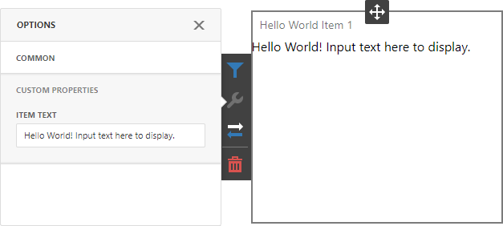
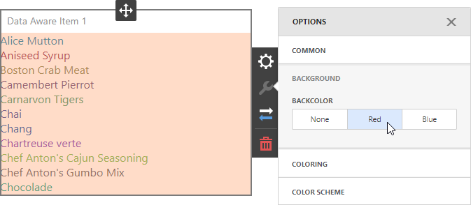
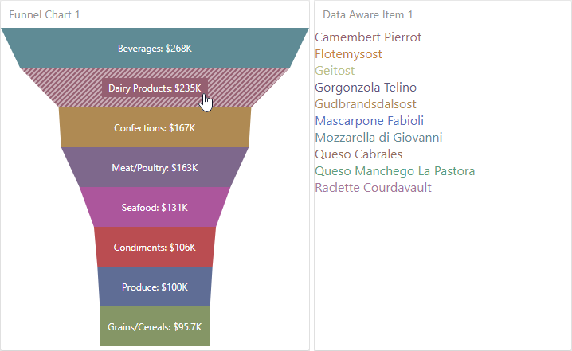

<!-- default badges list -->

<!-- default badges end -->
# BI Dashboard for ASP.NET Core - Custom Item Tutorials

The example contains the source code of the scripts created in the step-by-step [Custom Item](https://docs.devexpress.com/Dashboard/117546/web-dashboard/ui-elements-and-customization/create-a-custom-item) tutorials.

<!-- default file list -->

## Files to Review

* [HelloWorldItem.js](./CS/AspNetCoreCustomItemTutorials/wwwroot/js/HelloWorldItem.js)
* [DataAwareItem.js](./CS/AspNetCoreCustomItemTutorials/wwwroot/js/DataAwareItem.js)
* [FunnelChartItem.js](./CS/AspNetCoreCustomItemTutorials/wwwroot/js/FunnelChartItem.js)
* [_Layout.cshtml](./CS/AspNetCoreCustomItemTutorials/Pages/_Layout.cshtml)

<!-- default file list end -->

## Static Custom Item

**View Tutorial**: [Create a Static Custom Item](https://docs.devexpress.com/Dashboard/119836/web-dashboard/ui-elements-and-customization/create-a-custom-item/create-a-static-item)

**View Script**: [HelloWorldItem.js](CS/AspNetCoreCustomItemTutorials/wwwroot/js/HelloWorldItem.js)

The script contains a HelloWorld [static custom item](https://docs.devexpress.com/Dashboard/119836/web-dashboard/ui-elements-and-customization/create-a-custom-item/create-a-static-item) with a [custom property](https://docs.devexpress.com/Dashboard/401702/web-dashboard/client-side-customization/custom-properties) that allows you to change the static text.

## Data-Aware Custom Item

**View Tutorial**: [Create a Data-Aware Custom Item](https://docs.devexpress.com/Dashboard/119837/web-dashboard/ui-elements-and-customization/create-a-custom-item/create-a-data-aware-item)

**View Script**: [DataAwareItem.js](CS/AspNetCoreCustomItemTutorials/wwwroot/js/DataAwareItem.js)

This script contains a [data-aware custom item](https://docs.devexpress.com/Dashboard/119837/web-dashboard/ui-elements-and-customization/create-a-custom-item/create-a-data-aware-item) that displays [formatted](https://docs.devexpress.com/Dashboard/116539/common-features/data-shaping/formatting-data) [dimension values](https://docs.devexpress.com/Dashboard/116535/common-features/data-shaping/grouping) and allows users to [color](https://docs.devexpress.com/Dashboard/116915/common-features/appearance-customization/coloring) these values.

## Data-Aware Item based on External Visualization Widget

**View Tutorial**: [Create a Data-Aware Item based on an External Visualization Widget](https://docs.devexpress.com/Dashboard/119838/web-dashboard/ui-elements-and-customization/create-a-custom-item/create-a-data-aware-item-using-an-external-visualization-widget)

**View Script**: [FunnelChartItem.js](CS/AspNetCoreCustomItemTutorials/wwwroot/js/FunnelChartItem.js)

This script contains a more "real-world" custom item that uses an external visualization widget. In this example, it is the [dxFunnel](https://js.devexpress.com/DevExtreme/ApiReference/UI_Components/dxFunnel/) widget that can show values across multiple stages in a process. This widget supports [data binding](https://docs.devexpress.com/Dashboard/116982/web-dashboard/create-dashboards-on-the-web/binding-dashboard-items-to-data/bind-dashboard-items-to-data-in-the-web-dashboards-ui), [master filtering](https://docs.devexpress.com/Dashboard/117060/web-dashboard/create-dashboards-on-the-web/interactivity/master-filtering), and [coloring](https://docs.devexpress.com/Dashboard/117152/web-dashboard/create-dashboards-on-the-web/appearance-customization/coloring).

## Documentation

* [Create a Custom Item](https://docs.devexpress.com/Dashboard/117546/web-dashboard/ui-elements-and-customization/create-a-custom-item)

## More Examples

* [Dashboard for ASP.NET Core - Custom Item Gallery](https://github.com/DevExpress-Examples/asp-net-core-dashboard-custom-item-gallery)
* [Dashboard for ASP.NET Core - Custom Properties](https://github.com/DevExpress-Examples/asp-net-core-dashboard-custom-properties-sample)
* [Dashboard for React - Custom Item Tutorials](https://github.com/DevExpress-Examples/dashboard-react-app-custom-item-tutorials)
<!-- feedback -->
## Does this example address your development requirements/objectives?

 

(you will be redirected to DevExpress.com to submit your response)
<!-- feedback end -->
